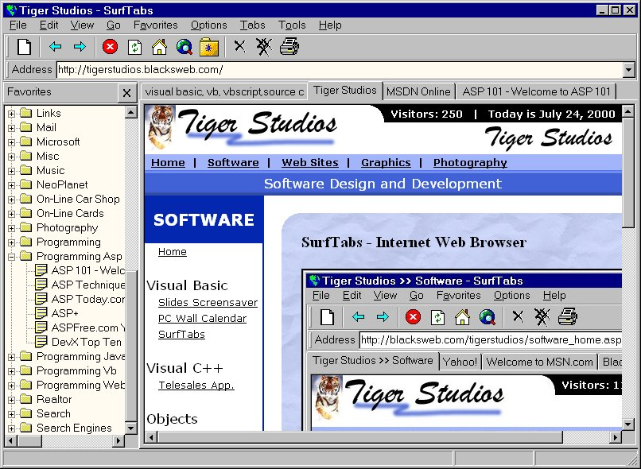



## SurfTabs

### Description

A Web browser using the IE browser object. Surf multiple web sites at the same time on different tabs. Unfortunatly it seems Eric Malamisua had the same idea with Netab (to reproduce NetCaptor), but I have been working on this on and off now for about 8 months or more.

Includes most if not all browser functionality: Forward, Backward, Stop, Refresh, Home, Search, Favorites (Add, Organize and View using IE's favorites), Options (SurfTabs and IE options), History (using IE's history) and other common features.

Can add tabs, delete tabs, delete all tabs. Tabs are given the name of the web page. Minimize to system tray. Completely resizeable. Will work with IE4, but not all will work.

Thanks to Chris Shell for the favorites code.

Thanks to Jelsoft Vb-World at http://www.jelsoft.com/vbw/ for the Registry code.

I think there is a bug in the Favorites code somewhere. Other then that, it sould be bug free.

Some future enhancements will include: blocking individual "popup" sites, View page source, A search pane (like the favorites one), New icon logo, Animated icon logo, to name a few.

Please enjoy. I welcome any comments, sugestions and recommendations.
 
### More Info
 

             |
---                |---
**Submitted On**   |2000-08-17 13:26:18
**By**             |[Jim Black](https://github.com/Planet-Source-Code/PSCIndex/blob/master/ByAuthor/jim-black.md)
**Level**          |Advanced
**User Rating**    |4.9 (68 globes from 14 users)
**Compatibility**  |VB 6\.0
**Category**       |[Complete Applications](https://github.com/Planet-Source-Code/PSCIndex/blob/master/ByCategory/complete-applications__1-27.md)
**World**          |[Visual Basic](https://github.com/Planet-Source-Code/PSCIndex/blob/master/ByWorld/visual-basic.md)
**Archive File**   |[CODE\_UPLOAD90448172000\.zip](https://github.com/Planet-Source-Code/jim-black-surftabs__1-9948/archive/master.zip)

